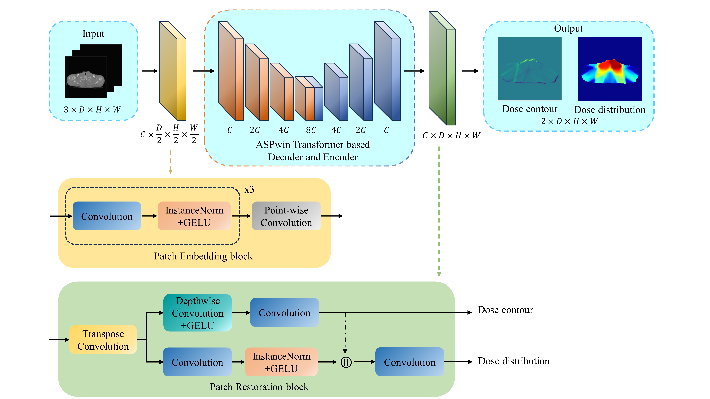

# ASPwin-Unet
This is the official PyTorch implementation of the ASPwin-Unet from 'ASPwin-Unet: Unet-like Transformer with Atrous Spatial Pyramid Windows for Dose Distribution Prediction'. 

The ASPwin-Unet is a novel transformer-based 3D dose distribution prediction network as a new scheme for automatically predicting dose distribution in treatment planning. We innovatively propose the ASPwin transformer block and employ Focused Linear Attention, along with introducing dose contour prediction auxiliary task. 

## Requirements
- torch >= 1.9.0+cu111 
- tqdm >= 4.62.2 
- simpleitk >= 2.1.0 
- numpy >= 1.21.2 
- opencv-python >= 4.5.3.56 
- pandas >= 1.2.4 
- scipy >= 1.6.2 
- einops >= 0.3.0 
- timm >= 0.4.12 
- yaml >= 0.2.5 
- pyyaml >= 5.4.1 
- monai >= 0.6.0

## Usage
1. Data Preparation

    The ASPwin_unet was trained and tested in the [OpenKBP challenge repository](https://github.com/ababier/open-kbp). We have prepared the dataset and put it in the `./Data/OpenKBP_C3D` directory.

2. Training

    The default parameters of network are stored in `./Configs/ASPwin_Unet.yaml`. 

    Run:
    ~~~
      cd /your_root_directory/ASPwin-Unet/ASPwin_Unet
      python train.py
    ~~~
    **The `/your_root_directory` is the root directory of your project.**

    **The saved model files will be stored in the `./Output/ASPwin_unet` directory.**

3. Testing

    Using the `best_val_evaluation_index.pkl` file in the `./Output/ASPwin_unet` directory for network testing. 
    
    Run:
    ~~~
      cd /your_root_directory/ASPwin-Unet/ASPwin_Unet
      python test.py
    ~~~
    **The prediction results will be saved in `./Output/ASPwin_Unet/Prediction`.**

## Acknowledgement
Thank OpenKBP Organizers： Aaron Babier, Binghao Zhang, Rafid Mahmood, Timothy Chan， Andrea McNiven， Thomas Purdie， and Kevin Moore. 

- https://github.com/ababier/open-kbp
